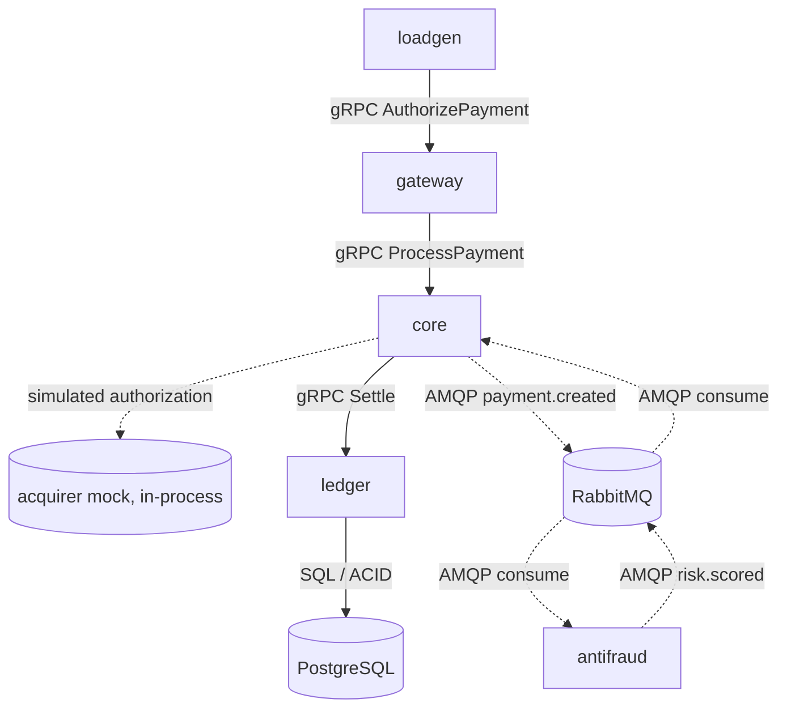

# Project Context — gRPC over TCP vs QUIC Benchmark

> **How to use this file:** attach or reference this file at the start of every prompt/session.
> It is the single source of truth for scope, architecture, conventions and decisions.
> When a decision changes, update section 12 (Decision Log) and section 13 (Open Decisions) in the same change.
> Active plan: [`doc/plan/POC_PLAN.md`](plan/POC_PLAN.md).

---

## 1. Project Summary

- **What:** Undergraduate thesis (TCC) — *"Desempenho do gRPC sobre TCP e QUIC: uma análise comparativa em arquiteturas de microsserviços"*.
- **Author:** Alexandre Padilha — Bachelor in Information Systems, UTFPR (Curitiba), 2026.
- **Advisor:** Prof. Dr. Ana Cristina Barreiras Kochem Vendramin.
- **Source document:** `doc/TCC_AlexndrePadilha .pdf` (proposal, v11.0).
- **Goal:** quantitative, controlled comparison of the performance and resilience of **gRPC over HTTP/2 (TCP)** vs **gRPC over HTTP/3 (QUIC)** inside a functional microservices ecosystem (mock payment gateway) under network stress.
- **The system is a measurement instrument.** Business logic exists to generate realistic inter-service traffic. Every design choice must favor **fairness between the two transports, reproducibility and measurability** over feature richness.

### 1.1 Research focus

- Head-of-Line Blocking (HoLB): TCP blocks all multiplexed HTTP/2 streams on a single lost segment; QUIC isolates loss per stream.
- Connection setup cost: TLS 1.3 integrated in QUIC, 1-RTT handshake and 0-RTT resumption.
- Connection migration: QUIC Connection ID survives client IP change; TCP connection breaks.

### 1.2 Specific objectives (from the proposal)

1. Design and implement a functional microservices ecosystem using gRPC over HTTP/2 (TCP) and HTTP/3 (QUIC).
2. Define a controlled experimental environment and metrics: latency, throughput, error rate, recovery time.
3. Run load/stress tests under packet loss, latency variation (jitter) and connection instability.
4. Measure and compare the HoLB impact on each stack.
5. Evaluate resilience: connection recovery and retransmission after network failures.
6. Statistically analyze results, identifying significant differences.
7. Discuss practical implications for QUIC adoption in microservices.

### 1.3 Delivery strategy

Two stages:

1. **POC (current):** reusable gRPC layer (`grpcq`) + a basic Echo client/server + the complete test environment (Docker, load generation, network impairment, result storage, analysis and report). Detailed in `doc/plan/POC_PLAN.md`.
2. **TCC system:** replace the Echo server and Echo workload with the payment microservices (section 4) while keeping `grpcq`, the test environment and the analysis pipeline unchanged.

---

## 2. Working Agreement (applies to every prompt)

- **Plan first.** Before generating or modifying code, outline the approach, architecture and file changes, and wait for explicit approval.
- **Ambiguity:** when multiple valid approaches exist, list the trade-offs and ask. Do not assume.
- **Language:** all code, identifiers, comments, log messages, commit messages and docs in the repo are in **English**. Conversation with the author may be in Portuguese.
- **Comments and logs:** short, meaningful, straight to the point.
- **Code quality:** clean, modular, SOLID, idiomatic Python. Robust error handling and edge-case validation by default.
- **Diffs:** use complete code blocks or unified diffs. No placeholders like `# ... rest unchanged`.
- **Git:** never run or suggest `git push`. Pushes are manual. Work on `develop` or `feature/*` branches, never directly on `main`.
- **Fairness guard:** any change that affects only one transport (TCP or QUIC) must be called out explicitly and justified.
- **Reuse guard:** POC code outside `src/services/echo` and `src/bench/workloads/echo.py` is permanent. It must not depend on Echo-specific types.

---

## 3. Technology Stack

| Concern | Choice | Notes |
|---|---|---|
| Language | Python 3.13 (pin exact version in `pyproject.toml`) | Confirm `aioquic` wheels for the pinned version. |
| Async runtime | `asyncio` (default loop) | Same loop for both transports (D17). |
| Dependency mgmt | `uv` | Single `pyproject.toml` and lockfile at repo root. |
| Serialization | Protocol Buffers (`protobuf` runtime) | Messages generated with `grpcio-tools` (codegen only, with `.pyi`). |
| HTTP/2 transport | `h2` (sans-IO) over `asyncio` TCP + `ssl` (TLS 1.3) | ALPN `h2`. |
| HTTP/3 transport | `aioquic` (QUIC + H3, sans-IO) | ALPN `h3`. |
| gRPC layer | **Custom, shared** (`grpcq` package) | See section 5. |
| Interop validation | `grpcio` (tests only) | Proves our HTTP/2 wire format is real gRPC. |
| Config / schemas | `pydantic` + `pydantic-settings` | Env config and scenario YAML validation. |
| CLI | `typer` | `bench` command. |
| Result storage | `pyarrow` (Parquet), JSON/JSONL | Raw per-request records. |
| Docker control | `docker` Python SDK + `docker compose` CLI | exec, stats, cp; compose up/down. |
| Messaging (TCC stage) | RabbitMQ (AMQP 0-9-1) via `aio-pika` | Pub/Sub for risk events. |
| Database (TCC stage) | PostgreSQL via `asyncpg` | Ledger persistence, ACID, concurrency control. |
| Load generator | Custom asyncio open-loop generator (`bench.loadgen`) | Replaces Locust/JMeter shown in proposal Fig. 5. |
| Network emulation | Linux `tc` / `netem` | Applied per container interface on `grpc_net`. |
| Orchestration | Docker Compose (base + target overlays) | Isolated virtual networks. |
| Docker host | **Linux VM on Hyper-V** (Ubuntu Server 24.04 LTS, Docker Engine) | Repo cloned in the VM (D16). Docker Desktop WSL2 backend is unsupported: its kernel lacks `sch_netem`. |
| Quality | `ruff` (lint + format), `mypy --strict`, `pytest`, `pytest-asyncio` | |
| Analysis | `pandas`, `numpy`, `scipy`, `matplotlib` | `bench analyze` / `bench report`. |
| Task runner | `Makefile` | Shortcuts over `uv run` and `bench`. |

**Why a custom gRPC layer:** as of 2026 no Python gRPC library supports HTTP/3. `grpcio` (C-core) has no HTTP/3 transport, and `connect-python` supports the gRPC protocol only over HTTP/2. Using `grpcio` for TCP and a pure-Python stack for QUIC would compare C against Python, not TCP against QUIC. Both stacks therefore share one pure-Python gRPC layer and differ **only** in the transport adapter.

---

## 4. TCC System Architecture (target of stage 2)

### 4.1 Services

| Service | Role | Inbound | Outbound |
|---|---|---|---|
| `gateway` (API Gateway / Order Service) | Single entry point; orchestrates the transaction lifecycle. | gRPC from load generator | gRPC → `core` |
| `core` (Processing Service) | Financial business rules; simulates acquirer authorization; publishes events. | gRPC from `gateway` | gRPC → `ledger`; AMQP publish; AMQP consume (risk results) |
| `ledger` (Accounts Service) | Balance updates with DB concurrency control; persists final payment state. | gRPC from `core` | SQL → PostgreSQL |
| `antifraud` (Risk Scoring) | Consumes payment events, scores risk, publishes result. | AMQP consume | AMQP publish |
| `rabbitmq` | Message broker (pub/sub). | — | — |
| `postgres` | Transactional database. | — | — |
| `loadgen` | Generates load, records client-side metrics. | — | gRPC → `gateway` |

External acquirers are **simulated inside `core`** (configurable delay and decline rate), not a separate network hop.

### 4.2 Flow



Solid lines = synchronous gRPC (transport under test). Dotted lines = asynchronous AMQP or in-process.

### 4.3 Hops under test

The transport (`h2` or `h3`) applies to **every gRPC hop**: `loadgen → gateway`, `gateway → core`, `core → ledger`. AMQP and SQL are **not** under test and must not be affected by network impairment.

### 4.4 Network topology (Docker Compose)

- `grpc_net`: carries only gRPC traffic. Fixed subnet; `ip_range` restricted so a reserved block is free for migration addresses (S4). Network impairment is applied **only** here.
- `infra_net` (TCC stage): AMQP and SQL traffic. Never impaired.
- Containers on `grpc_net` have `cap_add: [NET_ADMIN]` and `iproute2` installed.
- CPU pinning (`cpuset`) per container so client and server never share cores.

### 4.5 POC topology (stage 1)

`loadgen → echo-server` on `grpc_net`. Same base compose file; the Echo server is a target overlay that stage 2 replaces with the TCC services overlay.

---

## 5. gRPC Layer Design (`grpcq` package)

### 5.1 Layering

```
services (business logic)          ← transport-agnostic
   │
grpcq.rpc       (server/client API, method registry, deadlines, status codes, metadata)
   │
grpcq.wire      (gRPC message framing, header/trailer building and parsing)
   │
grpcq.transport (abstract Transport / Connection / Stream interfaces)
   ├── grpcq.transport.h2   (h2 + asyncio TCP + ssl)
   └── grpcq.transport.h3   (aioquic QUIC + H3)
```

- Business code depends only on `grpcq.rpc` abstractions (Dependency Inversion).
- Transport is selected at startup from configuration (`GRPC_TRANSPORT=h2|h3`). No transport-specific branches in business code.

### 5.2 Wire protocol (official gRPC over HTTP/2 spec; same mapping for HTTP/3 per gRPC proposal G2)

- Request: `:method POST`, `:scheme https`, `:path /<package>.<Service>/<Method>`, `content-type: application/grpc+proto`, `te: trailers`, optional `grpc-timeout`, custom metadata.
- Message framing: 1-byte compressed flag (always `0`, no compression) + 4-byte big-endian length + protobuf payload.
- Response: headers (`:status 200`, `content-type`), message(s), then **trailers** with `grpc-status` and optional `grpc-message`. Trailers-only responses for immediate errors.
- Enforce max message size (configurable, default 4 MiB) and reject malformed frames with `INTERNAL`.
- Supported RPC kind: **unary** (required). Streaming is out of scope.

### 5.3 Connection model

- One long-lived connection per client→server pair, multiplexing concurrent RPCs as streams (this is what exposes HoLB).
- Connection pool size is configurable but must be **identical** for both transports in any run (default `1`).
- Liveness: HTTP/2 PING keepalive (h2) and QUIC idle timeout / PING (h3), with equivalent timeouts.
- Reconnect with exponential backoff + jitter on connection loss; each attempt logged.
- **Network-change hook:** clients expose `on_network_change(new_local_addr)`. h3 migrates the path (same connection). h2 cannot migrate, so it reconnects from the new address.

### 5.4 TLS and handshake parity

- TLS 1.3 on both stacks, same self-signed CA and server certificates (generated by a script, never committed).
- Same cipher suite on both (default `TLS_AES_128_GCM_SHA256`).
- TCP: session resumption allowed; no TCP Fast Open. QUIC: session tickets enabled; 0-RTT is a **per-run flag** (off by default).
- Congestion control: align where possible (Linux TCP default `cubic`; configure `aioquic` to `cubic` if supported, else record the difference). Always record the actual algorithm in run metadata.

### 5.5 Deadlines, errors, retries

- Every client call has a deadline (`grpc-timeout`). Deadline exceeded → `DEADLINE_EXCEEDED`.
- Transport failures map to `UNAVAILABLE`.
- Automatic retries are **off by default** so raw error rates are measurable. A retry policy (max attempts, exponential backoff with jitter) is enabled only in resilience scenarios; always recorded in run metadata.

### 5.6 Interop test

`tests/interop`: our H2 client ↔ `grpcio` server and `grpcio` client ↔ our H2 server must succeed for all RPCs.

### 5.7 Stubs

POC: hand-written typed client stubs and servicer base classes (Echo only). A `protoc` plugin is evaluated before stage 2 (open decision).

---

## 6. Domain Model

### 6.1 POC contract

`diagnostics.v1.EchoService.Echo(EchoRequest) → EchoResponse`
- `EchoRequest`: `payload` (bytes), `response_size` (uint32), `server_delay_us` (uint32).
- `EchoResponse`: `payload` (bytes, `response_size` long), `server_recv_unix_ns` (int64).
- Server validates sizes against limits (`INVALID_ARGUMENT` when exceeded).
- This service stays in the final system as a diagnostic probe on every service.

### 6.2 TCC contracts (draft — finalize in stage 2)

Package `payments.v1`:
- `GatewayService.AuthorizePayment`, `CoreService.ProcessPayment`, `LedgerService.Settle`, `LedgerService.GetBalance`.
- Key fields: `payment_id` (UUID), `idempotency_key`, `merchant_id`, `payer_account_id`, `payee_account_id`, `amount_minor` (int64, cents — never float), `currency` (ISO 4217), `payload_padding` (bytes).
- AMQP events: `payment.created`, `risk.scored`.

### 6.3 Payment state machine

`PENDING → AUTHORIZED → SETTLED`; `PENDING → DECLINED`; `AUTHORIZED → FAILED`. Risk result (`APPROVED | REVIEW | REJECTED`) attached asynchronously; `REJECTED` after settlement marks `FLAGGED`.

### 6.4 Ledger rules

- Idempotent `Settle` keyed by `idempotency_key` (unique constraint).
- One transaction per balance update; `SELECT ... FOR UPDATE` with lock ordering by account id.
- Insufficient funds → `FAILED_PRECONDITION`.
- Seeded accounts per run; invariant check after each run (sum of balances is constant).

---

## 7. Experimental Design

### 7.1 Scenarios

| ID | Name | Impairment on `grpc_net` | Purpose |
|---|---|---|---|
| S0 | Calibration | none | Load sweep to find max sustainable rate per transport; defines load levels for the other scenarios. |
| S1 | Baseline | none (< 1 ms, 0 % loss) | Raw overhead of each stack, incl. QUIC crypto overhead. |
| S2 | Packet loss | 1 %, 3 %, 5 % loss | HoLB impact on TCP vs QUIC stream independence. |
| S3 | Jitter | base delay + variation (e.g. 20 ms ± 10 ms, normal) | Latency stability and congestion control under variable delay. |
| S4 | Connection migration | client IP change at runtime | QUIC Connection ID migration vs TCP reconnect. |

- Parameters live in versioned scenario files (`experiments/scenarios/*.yaml`), never hard-coded.
- `netem` acts on **egress**; it is applied on both ends of a hop, and the effective per-direction loss is documented.
- `netem` jitter can reorder packets; record whether reordering is allowed per run.
- Load levels are defined as a fraction of the **lower** calibrated capacity of the two transports, so neither stack runs saturated.

### 7.2 Load profile

- Open-loop, constant arrival rate. Latency measured from the **scheduled** send time (avoids coordinated omission) and also from the actual send time.
- Configurable payload mix (e.g. mostly small requests + a fraction of large ones) to expose HoLB on small requests.
- Max in-flight cap; requests beyond the cap are recorded as client overload, never silently dropped.
- Each run: warm-up (discarded) → measurement window → cool-down.
- Repetitions per configuration (default ≥ 5), randomized execution order across transports, fixed seeds.

### 7.3 Metrics

| Metric | Definition | Source |
|---|---|---|
| Latency | Client-side time from scheduled send to response. p50, p90, p99, p99.9, mean, stddev. | loadgen |
| Throughput | Successful RPCs/s and application bytes/s over the measurement window. | loadgen |
| Error rate | Non-OK `grpc-status` / total, overall and per 1 s window. | loadgen |
| Recovery time | From fault onset (or IP change) to (a) first successful RPC and (b) throughput ≥ 90 % of pre-fault level over 1 s windows. | loadgen time series + events |
| Resource usage | CPU and memory per container (1 Hz). | Docker stats sampler |
| Handshake time | Connection establishment time (full, resumed, 0-RTT). | transport instrumentation |
| Impairment check | netem sent/dropped counters per interface. | `tc -s qdisc` before/after |

Raw per-request records are stored (not only aggregates) so any statistic can be recomputed.

### 7.4 Statistical analysis

- TCP vs QUIC per scenario/level: Mann–Whitney U + Cliff's delta; bootstrap CIs for percentiles; α = 0.05 with Holm correction.
- Plots: latency CDFs, percentile vs loss rate, throughput vs load, time series around fault events.

### 7.5 Threats to validity (must be discussed in the thesis)

- TCP runs in the kernel; QUIC (`aioquic`) runs in user space in Python.
- Custom gRPC layer instead of an official implementation (mitigated by interop tests).
- Single-host Docker emulation inside a VM, not a real distributed network.
- Python single event loop may saturate before the network; CPU usage is reported to detect it.

---

## 8. Repository Layout

```
.
├── doc/
│   ├── TCC_AlexndrePadilha .pdf
│   ├── CONTEXT.md               # this file
│   └── plan/POC_PLAN.md
├── proto/diagnostics/v1/echo.proto          # payments/v1 added in stage 2
├── src/
│   ├── grpcq/                   # permanent: wire, rpc, transport/{h2,h3}, tls, config, telemetry
│   ├── bench/                   # permanent: loadgen, netem, faults, runner, sampler, analysis, report, cli
│   │   └── workloads/           # echo.py (POC) → payments.py (stage 2)
│   ├── services/
│   │   └── echo/                # POC target, replaced/extended in stage 2
│   └── gen/                     # generated protobuf code (git-ignored)
├── experiments/
│   ├── scenarios/*.yaml
│   └── results/                 # git-ignored
├── deploy/
│   ├── compose/base.yml         # networks, loadgen
│   ├── compose/echo.yml         # POC target overlay (stage 2: tcc.yml)
│   ├── docker/Dockerfile        # single image, entrypoint per role
│   └── certs/gen-certs.sh
├── scripts/setup-vm.sh
├── tests/{unit,integration,interop}/
├── Makefile
├── pyproject.toml
└── README.md
```

---

## 9. Configuration

- All configuration via environment variables, validated at startup with `pydantic-settings` (fail fast).
- Core variables: `GRPC_TRANSPORT` (`h2|h3`), `GRPC_ENABLE_0RTT`, `GRPC_POOL_SIZE`, `GRPC_DEADLINE_MS`, `GRPC_RETRY_ENABLED`, `GRPC_KEEPALIVE_MS`, `TLS_CA_PATH`, `TLS_CERT_PATH`, `TLS_KEY_PATH`, target addresses, `LOG_LEVEL`.
- Scenario files drive experiments; the runner injects the right variables per run.

---

## 10. Observability

- Structured JSON logs: wall-clock ns + monotonic ns, service, transport, event, method, status, duration.
- Connection lifecycle events: connect, handshake done (full / resumed / 0-RTT), migration, close, reconnect.
- Per-request records go to a buffered writer, never synchronous stdout on the hot path.
- Containers share the host clock; fault events and requests are correlated by wall-clock ns.

---

## 11. Testing Strategy

- **Unit:** framing (valid, truncated, oversized, compressed flag), headers/trailers, status mapping, `grpc-timeout` parsing, config and scenario validation, metric calculations.
- **Integration:** Echo end-to-end on both transports (in-process and in Docker).
- **Interop:** our H2 layer vs `grpcio`.
- **Parity:** the same suite runs against `h2` and `h3` (parametrized fixture).
- **Experiment smoke:** short run of every scenario before real batches.

---

## 12. Decision Log

| # | Date | Decision | Rationale |
|---|---|---|---|
| D1 | 2026-09-27 | Python as implementation language. | Author's choice. |
| D2 | 2026-09-27 | Docker Compose for the experimental environment. | Simpler than Kubernetes; easy `netem` and IP changes. |
| D3 | 2026-09-27 | Symmetric custom gRPC layer (`h2` and `aioquic`); `grpcio` only for interop tests. | No Python gRPC library supports HTTP/3; avoids C vs Python comparison. |
| D4 | 2026-09-27 | Custom asyncio open-loop load generator instead of Locust/JMeter. | Native asyncio integration; avoids coordinated omission. Thesis text/Fig. 5 must be updated. |
| D5 | 2026-09-27 | Separate `grpc_net` (impaired) and `infra_net` (never impaired). | Isolates gRPC transport effects. |
| D6 | 2026-09-27 | Acquirer simulated in-process inside `core`. | Keeps measured hops controlled. |
| D7 | 2026-09-27 | Docs consolidated in `doc/` (`doc/CONTEXT.md`, `doc/plan/`), in English. | Author's choice; replaces `docs/CONTEXT.md`. |
| D8 | 2026-09-27 | Deliver a POC first (Echo + full test environment), then swap in the TCC services. | Validate concept and environment early; reuse everything except the target. |
| D9 | 2026-09-27 | Docker host is a local Linux VM (Ubuntu 24.04, Docker Engine). | WSL2 kernel lacks `sch_netem`. |
| D10 | 2026-09-27 | `grpcq` is built as permanent code in the POC. | Avoid rework in stage 2. |
| D11 | 2026-09-27 | POC RPC: unary `EchoService.Echo` with configurable payload sizes and server delay. | Exposes HoLB with concurrency on one connection; reused as diagnostic probe. |
| D12 | 2026-09-27 | POC covers S1–S4 end to end (plus S0 calibration). | Validate all scenarios, including the risky S4, early. |
| D13 | 2026-09-27 | Results as files (metadata JSON, Parquet, JSONL) + generated report (Markdown/HTML + PNG). | Offline, reproducible, thesis-ready. No Prometheus/Grafana. |
| D14 | 2026-09-27 | Python CLI (`bench`) + Makefile for execution. | Single orchestration path, testable. |
| D15 | 2026-09-27 | S4 fairness: both clients get a network-change notification; h3 migrates, h2 reconnects. | Best case for TCP; isolates the migration capability. |
| D16 | 2026-09-27 | Repo cloned inside the Hyper-V VM; builds, tests and experiments run there. Sync via Git remote (manual push). | Avoids remote-Docker and bind-mount issues. |
| D17 | 2026-09-27 | Plain `asyncio` event loop for both transports. | Simplicity and parity. |
| D18 | 2026-09-27 | Report sanity thresholds: loss within ±20 % relative, CPU < 80 % of a core per process, CV of p50 < 10 %. | Detects invalid runs (impairment mismatch, saturation, noise). |

---

## 13. Open Decisions

1. **Congestion control parity:** confirm `aioquic` CUBIC support in the pinned version.
2. **Stubs for stage 2:** hand-written vs `protoc` plugin.
3. **Risk scoring blocking or not (stage 2):** proposed default non-blocking.
4. **AMQP event encoding (stage 2):** JSON vs protobuf.
5. **Loss placement (stage 2):** all `grpc_net` hops at once vs one hop at a time.

---

## 14. Roadmap

1. **POC** — see `doc/plan/POC_PLAN.md` (Phase 0 environment, Phase 1 implementation, Phase 2 test environment).
2. **Stage 2 — TCC system:** payments protos → `ledger` → `core` → `antifraud` → `gateway` → `tcc.yml` overlay with `infra_net`, RabbitMQ, PostgreSQL → `payments` workload → full experiment batches → analysis for the thesis.

### 14.1 Thesis schedule (from proposal)

| Activity | Jun | Jul | Aug | Sep | Oct | Nov | Dec |
|---|---|---|---|---|---|---|---|
| Literature review | X | X | | | | | |
| System implementation | | X | X | X | | | |
| Experimental environment | | | X | X | | | |
| Experiments | | | | X | X | | |
| Results analysis | | | | | X | X | |
| Thesis writing | X | X | X | X | X | X | X |
| Final delivery / defense | | | | | | X | X |

---

## 15. Current Status

- Repository: `README.md`, `LICENSE`, thesis PDF, this file and the POC plan. Branches: `main`, `develop`.
- POC plan decisions confirmed (D15–D18).
- Step 0.2 (`scripts/setup-vm.sh`) and step 1.1 (repo bootstrap) written; pending validation on the VM (`setup-vm.sh`, `make install check certs`).
- Next step: step 1.2 (`echo.proto` + codegen), plan pending approval.

---

## 16. References (from the proposal)

- Khan, I.; Ahamad, M. K. (2025). *Enhancing security and performance of gRPC-based microservices using HTTP/3 and AES-256 encryption.* JISEM 10(42s).
- McDonald, K. (2024). *gRPC Over HTTP/3.* https://kmcd.dev/posts/grpc-over-http3/
- Clerix, S. D. (2024). *gRPC and QUIC: The future of microservices communication?*
- Filho, A. T. de O. (2020). *Uma análise experimental de desempenho do protocolo QUIC.* UFPE.
- Santos, M. B. dos (2018). *Uma análise comparativa entre gRPC e REST para a integração de serviços web.* UTFPR.
- Tanenbaum, A. S.; Van Steen, M. (2017). *Distributed Systems*, 3rd ed.
- Newman, S. (2021). *Building Microservices*, 2nd ed.
- gRPC docs: https://grpc.io — gRPC over HTTP/2 protocol spec; gRPC proposal G2 (HTTP/3).
- Protocol Buffers docs: https://protobuf.dev
