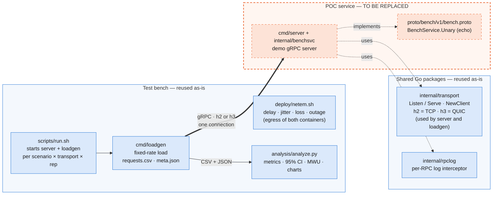
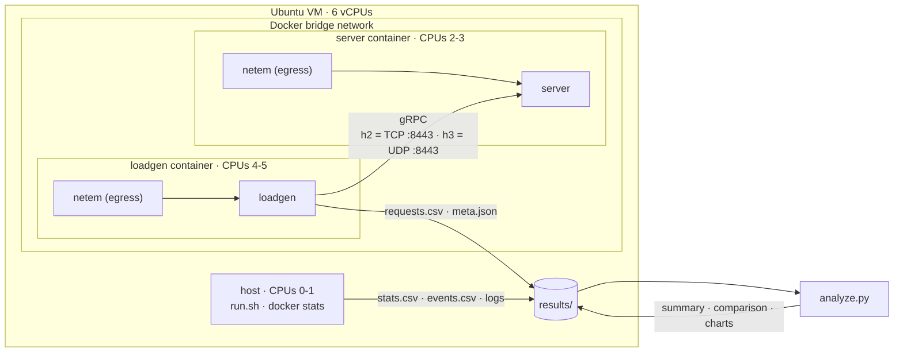
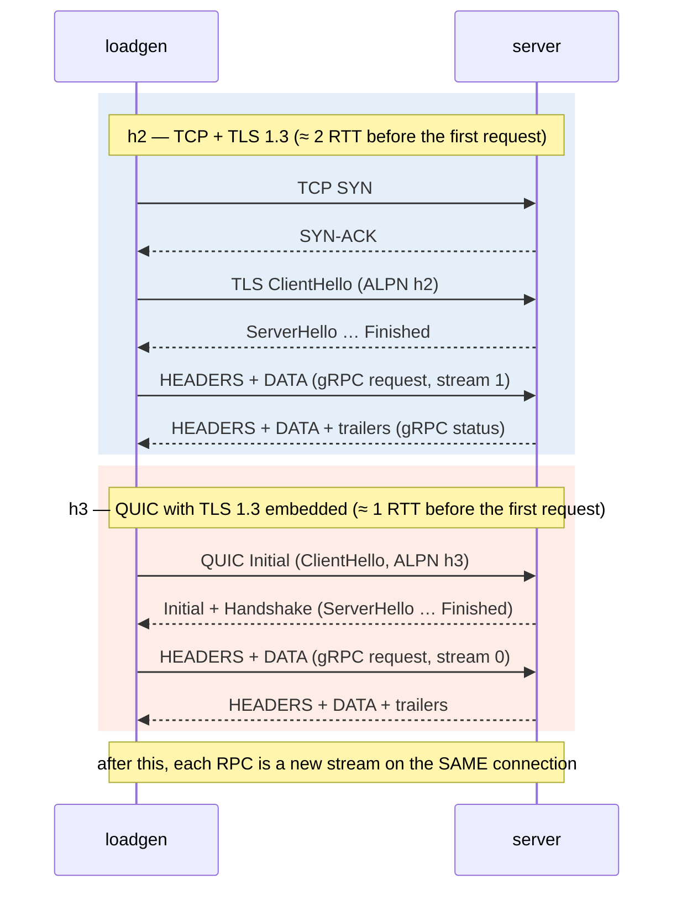
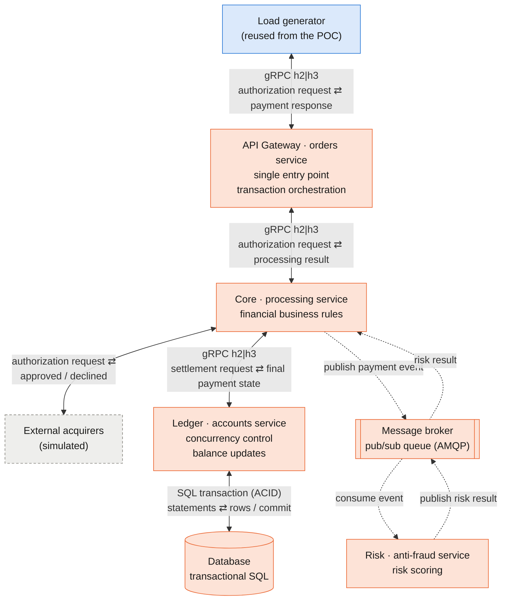
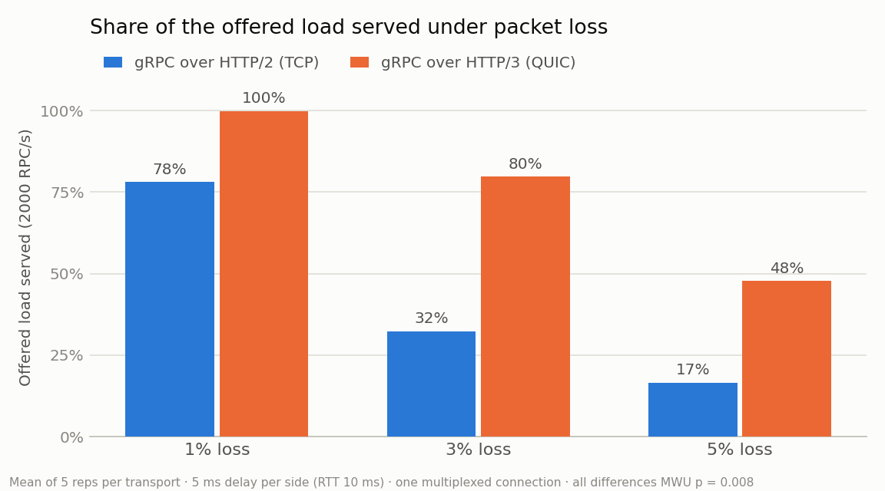

# POC Architecture — gRPC over HTTP/2 (TCP) vs HTTP/3 (QUIC)

## Summary

A minimal gRPC client/server pair whose transport switches between **HTTP/2 over TCP** and **HTTP/3 over QUIC** with one setting (`TRANSPORT=h2|h3`), plus a reproducible test bench:
  - Docker environment;
  - network fault injection (`tc netem`);
  - load generator;
  - automated runner;
  - statistical analysis.

---

## 1. POC architecture

### 1.1 Components

*Blue: reused as-is in the payment processing ecosystem. Orange, dashed: **replaced** by the Gateway, Core, Risk and Ledger services and their contracts (§2).*

**Stack:**
- Go 1.27 with **connect-go v1.21** speaking the real gRPC wire protocol (`connect.WithGRPC()`).
- `net/http` for HTTP/2 and **quic-go v0.63** (`http3`) for HTTP/3.
- Python (pandas, SciPy, matplotlib) for the analysis.

### 1.2 Deployment

Each container gets dedicated CPUs, so the client and server do not compete with each other.

### 1.3 gRPC communication flow

The only variable is the stack **below** gRPC. Everything else is identical in both runs:
- the same binary and the same TLS 1.3 certificate;
- the same limits: 1000 streams per connection, 5 s handshake timeout, 30 s idle timeout, no compression.

| | h2 | h3 |
|---|---|---|
| Application | gRPC (Protobuf) | gRPC (Protobuf) |
| HTTP | HTTP/2 | HTTP/3 |
| Security | TLS 1.3 | TLS 1.3 inside QUIC |
| Transport | TCP | QUIC over UDP |

**Connection setup and RPCs.** The client opens **exactly one connection**. Every RPC is a new stream multiplexed over it. This is required for head-of-line blocking (HoLB) to appear, and it is enforced: each run records a `dials` counter, and any run with `dials ≠ 1` is discarded.

**What happens when a packet is lost:**
- **h2:** all streams share one ordered TCP byte stream. A lost segment holds back the data of **every** stream until it is retransmitted. This is transport-level HoLB.
- **h3:** QUIC delivers each stream independently. A lost packet delays only the stream it belongs to.

**Protocol check.** The server returns an `x-served-proto` header with the protocol actually used. The client aborts if it does not match the requested transport, so there is never a silent fallback to HTTP/2.

### 1.4 Load model

- **Fixed-rate (open-loop) schedule:** the load generator plans the send times as `t_k = t0 + k / rate` and measures each latency from the **planned** time.
- **Why:** this avoids *coordinated omission*. If the server stalls, the RPCs that should have been sent still count with the latency a user would have felt.
- **Load in every scenario:** 2000 RPC/s, 500 workers, 60 s measured window after a 10 s warm-up, 1 KiB request and 1 KiB response.

---

## 2. Next step: payment processing ecosystem 

The payment gateway described in the project is built **inside this repository**. The four services replace `cmd/server` + `internal/benchsvc`. The transport, load generator, fault injection, runner and analysis are reused **without contract changes**.

*Based on the architecture proposed in the project (Figure 5). Solid double arrows: synchronous request/response. Dotted arrows: asynchronous events through the broker. Blue: reused from the POC. Orange: new. Gray, dashed: external dependency, simulated.*

| Interaction | Type | What goes and what comes back | Protocol |
|---|---|---|---|
| Load generator ⇄ Gateway | Synchronous | Authorization request ⇄ payment response | gRPC h2\|h3 |
| Gateway ⇄ Core | Synchronous | Authorization request ⇄ processing result | gRPC h2\|h3 |
| Core ⇄ Ledger | Synchronous | Settlement request ⇄ final payment state | gRPC h2\|h3 |
| Core ⇄ External acquirers | Synchronous | Authorization request (card, amount) ⇄ approved/declined + authorization code | Simulated; see note |
| Ledger ⇄ Database | Synchronous | SQL statements in an ACID transaction ⇄ rows, commit or error (e.g. lock timeout) | Database driver |
| Core → broker → Risk | Asynchronous | Payment event, one way | AMQP |
| Risk → broker → Core | Asynchronous | Risk result, returned as a new event | AMQP |

**Why the database and acquirer arrows are bidirectional.** Both are synchronous request/response exchanges:
- **Database:** the Ledger sends the statements of a transaction and waits for the result before answering the Core. A failed commit or a lock timeout also comes back on this path.
- **Acquirers:** an authorization is a request/response. The Core sends the card data and amount and waits for the approval or decline, with an authorization code, before it can answer the Gateway. Settlement with the acquirer happens later, in batch, and is outside the scope of this project.

**Open decision — how to simulate the acquirer:**

| Option | Effect on the experiment |
|---|---|
| Stub inside the Core (function with configurable latency and approval rate) | Simplest. No network hop, so the transport switch and netem do not affect it |
| Separate mock service (own container) | Adds a network hop where faults and timeouts can be injected, matching the planned "payment not processed due to timeout" failure. Its protocol must be chosen: the same `TRANSPORT` switch, or a fixed protocol, as a real external dependency would be |

| POC today | Payment processing ecosystem |
|---|---|
| `bench.proto` | One contract per service (Gateway, Core, Ledger), generated the same way |
| `cmd/server` + `benchsvc` | `cmd/gateway`, `cmd/core`, `cmd/risk`, `cmd/ledger`, each following the same template: config, `transport.Listen/Serve`, `rpclog`, health check, graceful shutdown |
| `internal/transport` | Unchanged. A single `TRANSPORT` switches **every** synchronous gRPC hop between h2 and h3 |
| `loadgen` | Same binary, targeting the Gateway entry RPC (e.g. `CreatePayment`) |
| `netem.sh` | In every service, so faults can be injected on any hop |
| `compose.yaml` | Adds the 4 services, the broker, the database and, if chosen, the acquirer mock. CPU pinning must be redistributed across the 6 vCPUs |
| Scenarios, runner, analysis | Same. **Scenario 4 (IP migration)** is added using quic-go's `AddPath`/`Probe`/`Switch` API |

**What changes in the results:**
- **Latency** becomes end to end, across several gRPC hops.
- **Asynchronous path:** Core → broker → Risk → broker → Core uses AMQP, so it is outside the h2/h3 comparison. The same applies to the Ledger's database connection.

---

## 3. Test environment and scenarios

### 3.1 Environment

- **Machine:** Ubuntu VM with 6 vCPUs, 8gb ram and Docker Compose, running on a Windows host.
- **CPU pinning:** host tooling on CPUs 0–1, server on CPUs 2–3, load generator on CPUs 4–5.
- **UDP buffers:** raised on the host to ≥ 7.5 MB, as quic-go recommends.
- **Fault injection:** `tc netem` on the egress of **both** containers, so each value applies **per direction**. For example, 5 ms per side gives a 10 ms RTT.
- **Repetitions:** 5 per scenario and transport. The h2/h3 order alternates on each repetition.
- **Validity checks per repetition:**
  - `dials = 1`;
  - not interrupted;
  - no loss of recorded rows;
  - `degraded_s`: seconds below 90% of the target rate with no injected fault, used to flag host noise.

### 3.2 Scenarios

| Scenario (project §3.2) |  config | Question |
|---|---|---|
| **s1 — Baseline** | no delay, no loss (RTT < 1 ms) | Raw overhead of QUIC/TLS vs TCP/TLS |
| **s2 — Packet loss** | 1%, 3%, 5% loss per direction, 5 ms delay per side | Impact of TCP HoLB vs QUIC stream independence |
| **s3 — Jitter** | 20 ms ± 10 ms (normal) per side, no loss | Stability under delay variation |
| **s5 — Outage (recovery time)** | 5 ms per side + 5 s outage (100% loss) on the server | Time to recover **on the same connection** |
| s4 — Connection migration | *deferred to the payment processing ecosystem phase* | Does QUIC's Connection ID keep the session through an IP change? |

### 3.3 Metrics

| Metric | Definition |
|---|---|
| Latency | p50 / p99 / p99.9 of successful RPCs, measured from the planned send time |
| Throughput | Successful RPCs per second. Shown as a **share of the offered load** (2000 RPC/s) |
| Error rate | Failed RPCs ÷ total (deadline 2 s) |
| Recovery time (s5) | Seconds from the end of the outage until throughput stays ≥ 90% of the pre-outage level for 3 consecutive seconds |
| Handshake | Duration of the first RPC, which opens the connection |
| CPU cost | Server CPU % per 1000 RPC/s |

**Statistics:** mean with 95% CI (Student's t) per scenario × transport. Differences are tested with a two-sided **Mann-Whitney U** test over per-repetition values. With 5 vs 5 repetitions, the smallest possible p-value is 0.008.

---

## 4. Partial results (run of 2026-09-28)

### 4.1 Overview

| Scenario | Result | Confidence |
|---|---|---|
| s1 — Baseline | **Tie.** p50 ≈ 1.1 ms on both; no significant difference in latency, handshake or CPU | Medium: host noise, clean repetitions only |
| s2 — Loss | **h3 serves 1.3× / 2.5× / 2.9× more load** at 1% / 3% / 5% loss | High: p = 0.008 at every level |
| s3 — Jitter | **Invalid:** both stacks collapse because of packet reordering caused by the netem setup | Must be re-run |
| s5 — Outage | h2 recovers in 1 s every time. h3 is **bimodal**: 0 s or 5 s. Outside the outage, h3 has an 18% faster handshake and 10% less CPU | Mixed: see §4.5 |

### 4.2 s1 — Baseline (ideal network)

Of 20 repetitions over two runs, 9 showed host CPU contention (`degraded_s > 0`), with no fault injected. Only clean repetitions are compared (h2 n = 5, h3 n = 6):

| Metric | h2 (median) | h3 (median) | p |
|---|---|---|---|
| p50 latency | 1.11 ms | 1.05 ms | 0.54 |
| p99 latency | 3.8 ms | 4.9 ms | 0.54 |
| Handshake | 4.2 ms | 5.1 ms | 0.33 |
| Server CPU per 1000 RPC/s | 53.8% | 54.9% | 0.93 |

**Reading:**
- At 2000 RPC/s, QUIC's extra cost in user space does not show.
- With RTT ≈ 0, QUIC's one-RTT handshake advantage cannot show either: the handshake time is dominated by CPU, not by round trips.
- This matches the expected result in the project (§4, Scenario 1).

### 4.3 s2 — Packet loss

| Loss | Successful RPC/s, h2 | Successful RPC/s, h3 | h3 / h2 |
|---|---|---|---|
| 1% | 1,562 | 1,998 | 1.28× |
| 3% | 647 | 1,596 | 2.47× |
| 5% | 332 | 954 | 2.88× |

**What happened.** With loss, the throughput of a single connection is capped by congestion control. The offered 2000 RPC/s exceeded that cap:
- for h2, at every loss level;
- for h3, from 3% loss on.

**Sanity check.** The Mathis formula for one TCP flow predicts ≈ 1,600 RPC/s for h2 at 1% loss; **1,562 was measured**. At 3% and 5% the measurements fall below the formula, which is expected once retransmission timeouts dominate.

**Latency is only comparable where nothing saturated, that is, h3 at 1% loss:** p50 29 ms and p99 206 ms. Elsewhere, latencies of 6 to 40 s are **queueing time** and are used only as a saturation signal.

Note: Other scenarios are under test