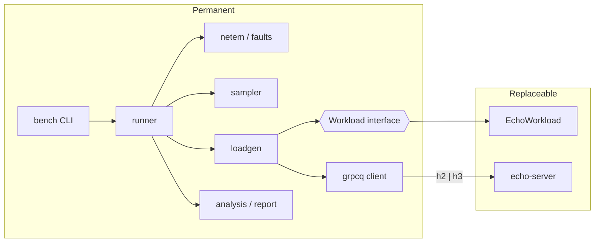

# POC Plan — gRPC over TCP vs QUIC

> Status: **approved decisions recorded; Phase 0 in progress**. Read together with [`doc/CONTEXT.md`](../CONTEXT.md).
> Each step below is implemented only after its own detailed plan (files, interfaces, tests) is approved.

---

## 1. Goal

Deliver a working, testable proof of concept that:

1. **Validates the concept:** a basic client and server exchange gRPC calls over **HTTP/2 (TCP)** or **HTTP/3 (QUIC)**, switched only by configuration.
2. **Validates the environment:** a reproducible Docker test bed that generates load, injects network impairment (loss, jitter, IP migration), stores logs and raw results, computes metrics and produces a comparison report.

After the POC, the Echo server and Echo workload are replaced by the TCC payment services. **Everything else is permanent.**

### 1.1 Out of scope

- Payment domain, RabbitMQ, PostgreSQL, multi-hop topologies.
- Streaming RPCs, compression, load balancing, service discovery.
- Live dashboards (Prometheus/Grafana).
- Final thesis-grade experiment batches (the POC runs small batches only).

---

## 2. Permanent vs replaceable

| Component | Path | POC | After POC |
|---|---|---|---|
| gRPC layer | `src/grpcq/` | Built for real | Kept |
| Load generator | `src/bench/loadgen/` | Built for real | Kept |
| Workload | `src/bench/workloads/` | `echo.py` | + `payments.py` |
| Network impairment + fault injection | `src/bench/netem/`, `src/bench/faults/` | Built for real | Kept |
| Runner, scenarios, results layout | `src/bench/runner/`, `experiments/scenarios/` | Built for real | Kept (new scenario files) |
| Resource sampler | `src/bench/sampler/` | Built for real | Kept |
| Analysis + report | `src/bench/analysis/`, `src/bench/report/` | Built for real | Kept |
| Target server | `src/services/echo/` | Echo server | TCC services (Echo kept as diagnostic probe) |
| Compose | `deploy/compose/base.yml` + `echo.yml` | Both | `base.yml` + `tcc.yml` |

Boundary rule: `bench` knows only the `Workload` interface and the target's compose overlay name. It never imports Echo types.



---

## 3. Phase 0 — Environment setup

**Goal:** a Linux VM where Docker and `netem` work, reachable from the Windows workstation.

| Step | Work | Deliverable |
|---|---|---|
| 0.1 | Create the Ubuntu Server 24.04 LTS VM on Hyper-V manually (settings in 3.1). | VM running, SSH reachable |
| 0.2 | `scripts/setup-vm.sh`: install Docker Engine + compose plugin, `iproute2`, `uv`; load `sch_netem`; raise UDP buffer limits (`net.core.rmem_max`, `wmem_max`); set CPU governor to `performance` if available. Idempotent. | Script + README section |
| 0.3 | Clone the repo inside the VM (D16). Sync with Windows through the Git remote (manual push on Windows, `git pull` in the VM). | Repo cloned in the VM |
| 0.4 | `bench doctor` (built in Phase 2, stubbed as a shell check here): verifies Docker version, `netem` on a throwaway container, free CPUs, clock. | Check passes |

**Exit criteria:** `tc qdisc add dev eth0 root netem loss 1%` succeeds inside a test container with `NET_ADMIN`.

### 3.1 Hyper-V VM settings

| Setting | Value | Why |
|---|---|---|
| Generation | 2 | UEFI. |
| Secure Boot | On, template **Microsoft UEFI Certificate Authority** (or Off) | The default Windows template blocks Ubuntu boot. |
| vCPUs | 4 minimum (6–8 if available), leave ≥ 2 cores for Windows | Client and server pinned to separate cores. |
| Memory | 8 GB **static** (Dynamic Memory off) | Avoids memory ballooning noise during runs. |
| Disk | 60 GB dynamic VHDX | Images + results. |
| Network | Default Switch (reach the VM at `<vm-name>.mshome.net`) or an External switch for a fixed IP | SSH from Windows and Internet access for Git/packages. |
| Checkpoints | Automatic checkpoints off | Avoids disk I/O surprises. |
| Ubuntu installer | Ubuntu 24.04 or 26.04 LTS (Server preferred; Desktop accepted, D19), **Install OpenSSH server** checked, no extra snaps (no Docker snap) | Docker Engine comes from Docker's apt repo in `setup-vm.sh`. |

Post-install manual checks (before `setup-vm.sh` exists):

```bash
uname -r                       # kernel version
sudo modprobe sch_netem && lsmod | grep netem
# if modprobe fails:
sudo apt install -y linux-modules-extra-$(uname -r) && sudo modprobe sch_netem
nproc && free -h
```

During experiment batches: close heavy Windows apps and keep the VM on AC power profile *High performance*. Record host details in batch metadata.

---

## 4. Phase 1 — Implementation (client, server, protocol switch)

| Step | Work | Tests | Size |
|---|---|---|---|
| 1.1 | **Repo bootstrap:** `pyproject.toml` (uv), ruff, mypy strict, pytest, Makefile, directory skeleton, `.gitignore`, `deploy/certs/gen-certs.sh` (CA + server cert with SANs for container names). | `make lint test` green on empty suite | S |
| 1.2 | **Proto + codegen:** `proto/diagnostics/v1/echo.proto`; `make proto` → `src/gen/` with `.pyi`. | Import smoke test | S |
| 1.3 | **`grpcq.wire` + `grpcq.rpc`:** framing encoder/decoder, header/trailer builders and parsers, `StatusCode`, `RpcError`, `grpc-timeout` codec, metadata, method registry, server/client abstractions, `Transport`/`Connection`/`Stream` interfaces. | Unit tests incl. malformed input | M |
| 1.4 | **H2 transport:** asyncio TCP + TLS 1.3 + `h2` state machine; client and server; flow-control windows; PING keepalive. | Echo round trip; **interop with `grpcio`** both directions | L |
| 1.5 | **H3 transport:** `aioquic` client and server; session tickets; optional 0-RTT; congestion control config. | Same parametrized suite as 1.4 (parity) | L |
| 1.6 | **Spike S4 (early risk):** h3 path migration via new local address with `aioquic`; h2 reconnect from new address. Outside Docker first, then in two containers. | Script proving h3 keeps the connection, h2 reconnects | M |
| 1.7 | **Connection lifecycle:** reconnect with backoff, `on_network_change` hook, handshake timing events, connection IDs in logs, retry policy (off by default). | Unit + integration (kill server, restart) | M |
| 1.8 | **Echo server + CLI client:** `python -m services.echo` and `bench call echo --transport h3 --count 10 --payload 1024`. Structured JSON logs. | Integration: both transports | S |
| 1.9 | **Docker smoke:** single `Dockerfile`, `base.yml` + `echo.yml`, healthchecks; client calls server in both transports. | `make smoke TRANSPORT=h2|h3` | S |

**Phase 1 exit criteria:**
- Same test suite passes on `h2` and `h3`.
- Interop with `grpcio` passes.
- Switching protocol requires only `GRPC_TRANSPORT`.
- S4 spike confirms feasibility (or a documented fallback is approved).

---

## 5. Phase 2 — Test environment

### 5.1 Steps

| Step | Work | Tests | Size |
|---|---|---|---|
| 2.1 | **Compose topology:** `grpc_net` with fixed subnet and restricted `ip_range` (reserved block for S4), `NET_ADMIN`, `cpuset` per container, results written to a named volume. | `bench doctor` + smoke | S |
| 2.2 | **Load generator:** open-loop constant rate, scheduled vs actual send time, max in-flight cap, payload mix, warm-up/measure/cool-down phases, buffered Parquet writer, `Workload` interface + `EchoWorkload`. | Unit: scheduler accuracy, overload accounting; integration vs Echo | L |
| 2.3 | **Netem module:** resolve `grpc_net` interface inside each container, apply/clear loss, delay, jitter, reorder; apply on both ends; capture `tc -s qdisc` before/after; timestamp events inside the container. | Integration: configured loss ≈ measured drop counters | M |
| 2.4 | **Migration injector (S4):** add reserved IP, notify client (`on_network_change`), remove old IP; record events. | Integration on both transports | M |
| 2.5 | **Resource sampler:** Docker stats at 1 Hz → `resources.parquet`. | Unit on parser; integration | S |
| 2.6 | **Scenario schema + runner:** YAML validated with pydantic; matrix expansion (transport × params × repetitions); randomized order with seed; per-run lifecycle (up → health → warm-up → faults → measure → cool-down → collect → down); failure handling (a failed run is recorded, batch continues). | Unit: schema, expansion; smoke batch | L |
| 2.7 | **Analysis:** per-run summary (percentiles, throughput, error rate, recovery time, CPU), per-batch aggregation, statistical tests (Mann–Whitney U, Cliff's delta, bootstrap CI, Holm). | Unit on synthetic data with known answers | M |
| 2.8 | **Report:** `report.md` + `report.html` + figures (latency CDF, percentile vs loss, throughput vs load, time series around events), run metadata table, sanity-check section. | Snapshot test on synthetic batch | M |
| 2.9 | **POC scenarios + execution:** S0 calibration, S1, S2 (1/3/5 %), S3, S4 for Echo; smoke batch; one small real batch; POC report committed to `doc/`. | `make poc` end to end | M |

### 5.2 Scenario file (draft shape)

```yaml
name: s2-loss
target: echo                    # compose overlay: deploy/compose/echo.yml
workload:
  kind: echo
  request_size_bytes: 1024
  response_size_bytes: 1024
  large_request_ratio: 0.05     # HoLB probe
  large_request_size_bytes: 262144
load:
  rate_rps: 500                 # or fraction of calibrated capacity
  max_in_flight: 2000
  warmup_s: 10
  measure_s: 60
  cooldown_s: 5
grpc:
  pool_size: 1
  deadline_ms: 2000
  retry_enabled: false
  enable_0rtt: false
network:
  apply_on: [loadgen, echo-server]
  netem:
    loss_percent: [1, 3, 5]     # list => matrix dimension
faults: []                      # S4: [{kind: ip_migration, at_s: 30}]
matrix:
  transport: [h2, h3]
  repetitions: 5
  seed: 42
```

### 5.3 Results layout

```
experiments/results/<batch_id>/
├── batch.json                    # scenario, expansion, execution order, host info, git commit
├── runs/<run_id>/
│   ├── metadata.json             # effective config, transport, CC algorithm, timings, status
│   ├── requests.parquet          # one row per request (see 5.4)
│   ├── events.jsonl              # netem applied/cleared, IP migration, reconnects
│   ├── resources.parquet         # CPU / memory per container, 1 Hz
│   ├── netem/{before,after}.txt  # tc -s qdisc output per container
│   ├── logs/<service>.jsonl      # structured service logs
│   └── summary.json              # produced by `bench analyze`
└── report/
    ├── report.md
    ├── report.html
    └── figures/*.png
```

### 5.4 Per-request record

| Field | Type | Notes |
|---|---|---|
| `seq` | int64 | Request sequence number |
| `scheduled_ns` | int64 | Intended send time (wall clock) |
| `sent_ns` | int64 | Actual send time |
| `done_ns` | int64 | Response or error time |
| `phase` | str | warmup / measure / cooldown |
| `status` | int8 | gRPC status code |
| `error` | str | Short error class, empty on success |
| `req_bytes` / `resp_bytes` | int32 | Application payload sizes |
| `size_class` | str | small / large |
| `conn_id` | str | Connection identifier (reconnects visible) |

### 5.5 CLI and Makefile

| Command | Purpose |
|---|---|
| `bench doctor` | Environment checks (Docker, netem, CPUs, clock) |
| `bench call echo ...` | Single manual calls for debugging |
| `bench run <scenario.yaml> [--smoke]` | Execute a batch |
| `bench analyze <batch_dir>` | Compute run summaries and batch statistics |
| `bench report <batch_dir>` | Generate report and figures |
| `make lint test proto certs smoke poc report` | Shortcuts |

**Phase 2 exit criteria:**
- `make poc` runs S0–S4 on both transports without manual steps and produces a report.
- Sanity checks in the report pass: measured netem drop ratio within tolerance of configured loss; no run saturated (CPU and client overload below thresholds); repetitions consistent (coefficient of variation of p50 below an agreed threshold).
- A failed run never corrupts the batch.

---

## 6. Validation of the concept (what the POC report must show)

The POC does not need to prove QUIC is better. It must show that the instrument can detect the effects under study:

| Check | Expected signal |
|---|---|
| S1 | Both transports work; overhead difference measurable; handshake times recorded. |
| S2 | Loss visible in netem counters; small-request tail latency on h2 grows with concurrent large requests (HoLB), and the difference vs h3 is measurable. |
| S3 | Latency distribution widens with jitter on both; variability comparable across repetitions. |
| S4 | h3: same `conn_id` before/after migration; h2: new `conn_id`, error burst, measurable recovery time. |

If a signal is absent, the report must explain whether it is a real result or an instrument limitation (e.g. CPU saturation).

---

## 7. Risks and mitigations

| Risk | Impact | Mitigation |
|---|---|---|
| `aioquic` client-side migration not exposed by public API | S4 blocked | Spike 1.6 early; fallback: rebind UDP socket (NAT rebinding) or small internal adapter, documented. |
| Python CPU saturation before the network | Results measure CPU, not protocol | S0 calibration; load levels below lower capacity; CPU reported per run; `cpuset` pinning. |
| Custom gRPC layer bugs | Invalid results | Interop tests with `grpcio`; parity suite. |
| netem queue limits / reordering side effects | Distorted loss/jitter | Explicit `limit`, reorder flag recorded, counters verified. |
| VM noise (host load, CPU scaling) | Variance | Randomized order, repetitions, governor, report CV. |
| UDP buffer defaults too small | Artificial QUIC drops | Raised in `setup-vm.sh`; recorded in host info. |
| Schedule (experiments planned for Sep–Oct) | Delay | S/M/L sizing, early risky spike, smoke batches before full batches. |

---

## 8. Transition to the TCC system (after the POC)

1. Add `proto/payments/v1/*.proto` and generate.
2. Implement `src/services/{gateway,core,ledger,antifraud}` on top of `grpcq` (Echo stays as diagnostic probe).
3. Add `deploy/compose/tcc.yml` with `infra_net`, RabbitMQ, PostgreSQL, seed data.
4. Add `src/bench/workloads/payments.py`.
5. Write new scenario files with `target: tcc`; same runner, analysis and report.
6. Resolve stage-2 open decisions (context section 13, items 2–5).

---

## 9. Confirmed decisions (2026-09-27)

1. **S4 fairness model:** both clients receive a network-change notification; h3 migrates the path, h2 reconnects from the new address. (Context D15.)
2. **Windows ↔ VM workflow:** the repo is cloned inside the VM; builds, tests and experiments run there. (Context D16.)
3. **Event loop:** plain `asyncio` for both transports. (Context D17.)
4. **Report sanity thresholds:** measured loss within ±20 % (relative) of configured loss; CPU < 80 % of one core per process; coefficient of variation of p50 across repetitions < 10 %. (Context D18.)
